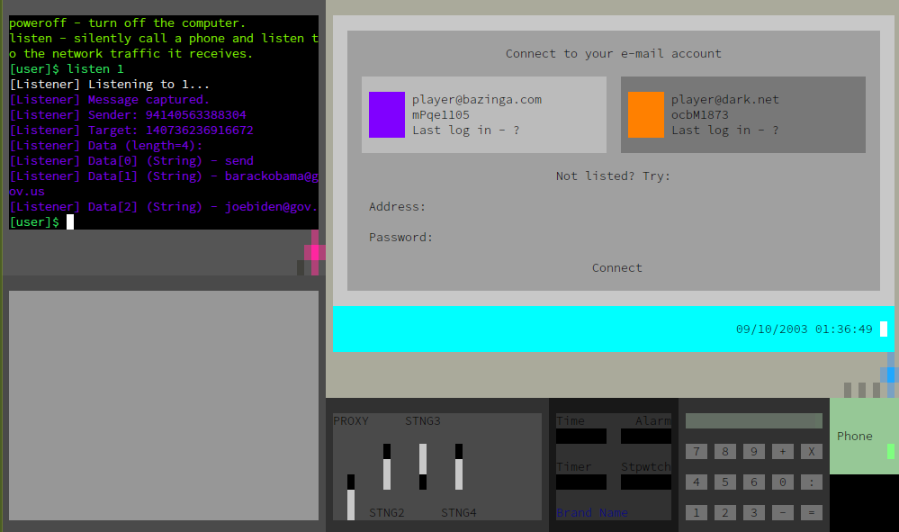
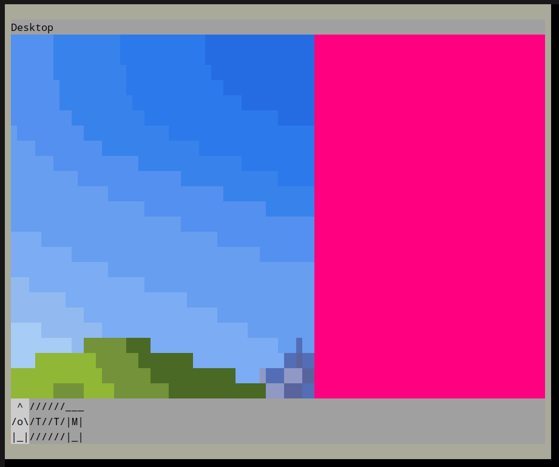
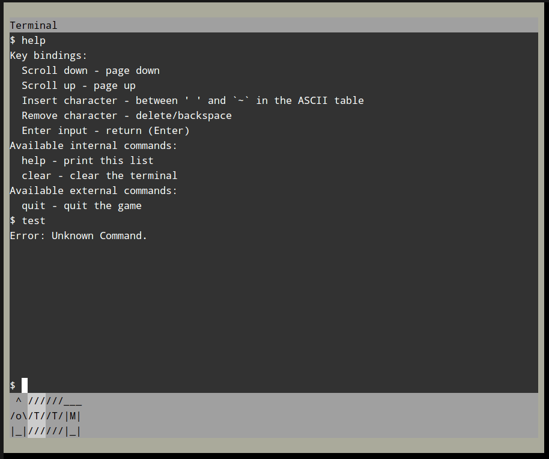

# *netset-core*, the framework of the future [KTech](https://github.com/TheRealKaup/KTech) game *netset*

- [Components](#components)
- [Doxygen Documentation (GitHub Pages)](https://therealkaup.github.io/netset-core/)
- [Vision](#vision) - what is this project and what will it be.
- [Contact Information](#contact-information) - how to contact the developer.

# Components

- [KTech](https://github.com/TheRealKaup/KTech): C++ 2D terminal game engine library.
- nsnet: netset's (*ns*) computer network (*net*) sandbox/simulation library. Located at [`lib/nsnet/`](https://github.com/TheRealKaup/netset-core/blob/main/lib/nsnet) in this repository.

# Vision

***netset-core*** will be the framework (GUI; game mechanics; libraries...) for the future [KTech](https://github.com/TheRealKaup/KTech) game ***netset***.

## netset

A future hacking game that involves a fictional networking simulation. The gameplay loop is initiated when a client contacts the player for information Z on entity X: the player converts entity X's known details into data Y, and data Y into information Z. The different game mechanics let the player obtain new information using known information, in order to reach a certain goal.

Although a sandbox, events occurring throughout the game are part of a full and linear story. As of 10 January 2024, the  script is over 12,000 words, and it continues to grow.

### Setting

I will not share any details of the plot itself, but parts of its theme are essential for forming a vision of _netset_ and for developing _netset-core_ ("#dnmw" is a name placeholder):

> The year is 2003. The world has other things to think about than hardware and software security: mainly geopolitical and economic issues. The world is narrow, boring, and monotonous, at least on the surface.
>
> Under the surface lays the darknet; legally gray, an unfiltered global computer network. The darknet isn't socially or politically contentious, but rather barely discussed by legal authorities; it's quite too small, new and esoteric to fit within society's mundane fields of interests.
>
> Within the darknet, a website by the name of #dnmw hosts the most gatekept marketplace, offering advertising services for the professionals among users. Completely under the radar, no law enforcement entity has ever reached it. The website works by reputation; users can make contact only with users at the same level or below.
>
> #dnmw's owners have interests of their own, and sometimes offer jobs to their most reputable users. This system grants them access to the best talent in the field, with it they tighten their grasp on international affairs and world power. Working with #dnmw means taking part in global crises and corruption, but it also means reward goes beyond money.
>
> The player is a hacker offering their services at #dnmw.

## netset-core

Includes everything that netset will require, except the story implementation. Opening this codebase now is good for many reasons:

1. Motivates personal development (that was my experience with opening KTech, at least).
	- [More KTech testing](https://github.com/TheRealKaup/KTech/blob/master/documentation/faq.md#is-ktech-stable).
2. Helps creating a community before the game is released.
	- Gameplay can be improved and expanded freely by whoever wishes to, already before the game is out, leading to a refined initial release.
	- Expedites development (contributors).
	- Increases potential for a successful release.
3. Repository can be linked in KTech's GitHub page and be used as an example for a large KTech program.

The sections here describe some of the features that should be in netset-core.

### GUI

The following is an old screenshot from 9 October 2023 of an old GUI attempt for netset (past development is discussed [later in this file](#past-development)). At that stage, there was an entire networking sandbox operating in the background.

- The upper-left "old computer" widget is a terminal (within it runs an entire shell program made with KTech's textures), which is one of the player's hacking interfaces. It is used to call commands that control the local networking devices and communicate with remote networks. For example, `listen 1` would use the local modified phone device to covertly pick up any networking packets received by the remote phone number 1. The computer may access one "net" at a time, the "darknet" or "internet", which can be switched between using the `netset <net>` command.
- The upper-right "modern computer" shows an email client. The networking sandbox has an email server implementation, one exists in the darknet and the other in the internet. The player can connect to one of their email accounts; the darknet account to contact clients, the internet account for other purposes (I don't have a concrete example for such purpose).
- The bottom-left widget is a whiteboard. I wanted to avoid the experience (from the player's perspective) of being told directly by the game what to do and how, so the terminal has a manual page, and this whiteboard is filled with to-do lists by the character the player is playing as. The player can mess around with the whiteboard if they so wish.
- The other widgets are various gadgets that didn't get much "creative thinking", frankly.



This minimal GUI can be, of course, evolved and decorated to infinity, but I feel that this functionalistic representation is the way to go, and this screenshot is at least 50% there in terms of the final product's aesthetics.

Here are 2 additional screenshots from a rewrite attempt I abandoned in 21 April 2024:



(The pink rectangle is there because I changed the resolution of the display but not of the background image)



### Networking sandbox

This section tries to concretize the "networking sandbox/simulation" thingy.

The following is a (slightly edited) snippet of the library I wrote to make the original networking sandbox:

```cpp
namespace Devices
{
	// The base device.
	class Device;
	// A base device which calls a processing function when it receives data.
	class Computer;
	// Forwards any data it receives to the rest of the devices connected to it.
	class Hub;
	// Forwards data it receives to the target device if it can find it.
	class Switch;
	// Communicates with other phones. Has a major vulnerability exploited by `Listener`.
	class Phone;
	// Silently calls `Phone`s and covertly listens to packets passing by.
	class Listener;
	// Connects a network with a net provider.
	class Modem;
	// Connects modems; one internet and one darknet instances.
	class NetProvider;
	// [...]
}
```

Each client, target, and the player themselves have a unique network setup. The player, for instance, could have:

- Modem that toggles between the internet's `NetProvider` and darknet's `NetProvider` (using the `netset` CLI).
- `Listener` to secretly pick up network traffic elsewhere.
- 2 `Computer`s (one for each display in the GUI).
- `Switch` to connect it all together.

The following were the significant parts of `Device`'s definition:

```cpp
class Device
{
protected:
	std::vector<Device*> connectedDevices;

public:
	std::string customName = "";
	inline virtual DeviceType GetType() { return DeviceType::Device; }
	bool Connect(Device* otherDevice);
	// [...]
	bool Disconnect(Device* otherDevice);
	// [...]
	virtual void Send(Device* target, uint32_t senderNetwork, uint32_t targetNetwork, Port port, const std::vector<Data>& data);
	// [...]
	virtual void Receive(Device* sender, Device* target, uint32_t senderNetwork, uint32_t targetNetwork, Device* giver, Port port, const std::vector<Data>& data);
};
```

There was a "network template" of an email provider (one instance was connected to the internet and another to the darknet), which was used as a human-communication tool between clients and targets:

```cpp
// Pre-made networks "templates"
namespace Networks
{
	// [...]
	class EmailProvider
	{
		// [...]
	protected:
		// `Computer::Program` receives network data designated to it by its parent computer.
		struct EmailProviderProgram : Devices::Computer::Program {/*[...]*/};

		Devices::Modem modem;
		Devices::Computer computer;
		EmailProviderProgram program;
		// [...]
	};
}
```

The EmailProvider network had inbound and outbound protocols, and the "modern computer" in the [October 2023 screenshot](#gui) shows a complying client that at the time could log into email accounts, accept emails and display them.

## Miscellaneous

### Licensing note

If the "-core" suffix initially made you raise an eyebrow, it does not imply any sort of closed core or something alike, as with some partially open projects. KTech is covered under the GPLv3-or-later, and so will netset-core and the final netset game. Everything remains free (as in freedom; I actually intend to sell copies of netset, this is my life's work after all).

### Past development

Previous codebases grew in size very quickly. The version which had the most features (I don't want to say "most complete", because all past versions were ridiculously undirected and far from finished) easily reached over 4000 lines of code (without comments), exceeding KTech itself (which was 3000 lines at the time), all in a couple of weeks.

That is, netset-core is destined to greatness.

I've abandoned and rewritten netset 3 times so far, each time failing to even imagine a glimpse of a functional gameplay loop. The obvious cause for the problem was KTech's own incompleteness back then, which now after a [first production release](https://github.com/TheRealKaup/KTech/releases/tag/v1.0.0), is nearly solved; netset-core development can start after I release [KTech v1.1.0](https://github.com/TheRealKaup/KTech/milestone/2) (introducing `StateMachine`).

Here's a relevant entry from KTech's FAQ, "[Is KTech Stable?](https://github.com/TheRealKaup/KTech/blob/master/documentation/faq.md#is-ktech-stable)":

> KTech is reasonably uncomplicated and is written under pretty rigid code conventions (see [style.md](https://github.com/TheRealKaup/KTech/blob/master/documentation/style.md)). Despite so, I frequently encounter bugs. This is very much not to be unexpected, as KTech has seen much more coding done on it than actual usage. Parallel to the last time I've worked on my game _netset_, I've composed what would seem a worryingly long list of overlooked parts (see [issue #58](https://github.com/TheRealKaup/KTech/issues/58)). Solving most of them was as easy as finding them. The asnwer to the question: no. But, what I'm propounding is that evidently, KTech is not fundamentally faulty, and rather it needs more testing and feedback.

### Name

I haven't settled on the name "netset" (in fact, the game's name in the script is just a placeholder, and not "netset" yet). I think it sounds adequate, and I'm quite fond of the in-game-terminal-command title drop. If the name is so cacophonous that it hinders you from investing, no worries, I'll discard it.

## Contact Information

For legal and business matters, Kaup (Ethan Kaufman), via email:

- ethan.kauf736@gmail.com